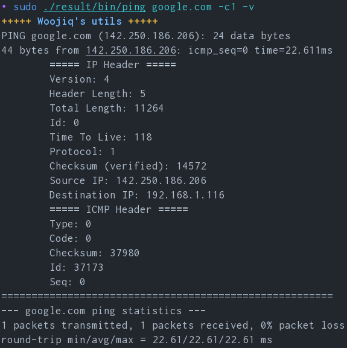
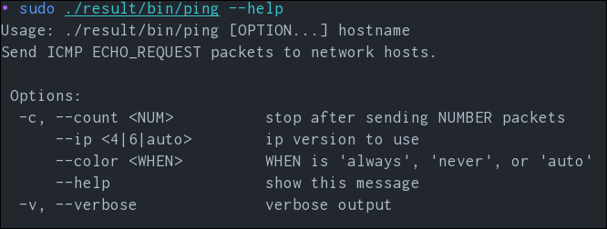

# Woojiq's Ping clone

Implementation of the well-known *ping* command-line utility for testing Internet connection using ICMP packets.

## Installation
There are two ways to install this software:
1. **Meson**. There are many guides in the web on how to do this, e.g. [Quick guide](https://mesonbuild.com/Quick-guide.html#compiling-a-meson-project).
2. **Nix**. Run the command `nix build .`.

Note that the package name is *ping*, so you'll need to create alias because almost guaranteeed you already have "default" ping installed on your machine.

## How to use
First of all, don't forget to run it with the `--help` option to see available functions.

#### Basic usage:
* `sudo ping google.com` - ping website indefinitely (press `Ctrl-C` to stop).
* `sudo ping google.com --count 2` - ping only two times.
* `sudo ping google.com -v` - print IP and ICMP headers for diagnostic.
* `sudo ping google.com --color none` - don't color output.

You need to run this command with `sudo` because it uses raw Linux sockets under the hood. This can be solved with file capabilities, but I haven't figured it out yet🧐🙈.

## Showcase

## Contribution
If you want to see a feature, better documentation, or add your platform to nix flake - fill an issue and I'll be happy to do it. I didn't set out to create the most enjoyable product for the end user on the beginning.

## Plans before v0.2
- [ ] IPv6 support.
- [ ] Migrate to Makefile
- [ ] Refactor *main.c* to make it ip version agnostic (move to libraries).

## Todo Pool
- [ ] Use link-layer access sockets to receive IPv6 and Ethernet data.
- [ ] Add timeout option.
- [ ] Write man page.
- [ ] Rework colored output.
